<div align="center">

# CYBERTRACE
### AI-Powered Unified Cyber Fraud Investigation &amp; Evidence Correlation Platform

> **"From Scattered Evidence to Actionable Intelligence."**

[](https://react.dev/)
[](https://www.typescriptlang.org/)
[](https://vitejs.dev/)
[](https://developer.mozilla.org/en-US/docs/Web/API/Web_Crypto_API)
[](#15-evidence-integrity--security)
[](https://github.com/snappyff43-hub/Void-Hackathon.git)
[](LICENSE)

<br/>

[Live Demo Walkthrough](#19-demo-workflow) • [System Architecture](#7-system-architecture) • [Theory Documentation](docs/theory/digital-forensics.md) • [Research References](docs/references.md)

</div>

---

> [!IMPORTANT]
> **SYNTHETIC DEMONSTRATION DATASET ONLY:** All cases, phone numbers, bank accounts, UPI VPAs, IP addresses, IMEI identifiers, and subscriber details in this application are **100% synthetic** and designed exclusively for evaluation and hackathon demonstration. No real personal, financial, or law-enforcement data is contained within this repository.

---

## Table of Contents
1. [Overview](#1-overview)
2. [Problem Statement](#2-problem-statement)
3. [Our Solution](#3-our-solution)
4. [Why CYBERTRACE?](#4-why-cybertrace)
5. [Key Features](#5-key-features)
6. [System Workflow](#6-system-workflow)
7. [System Architecture](#7-system-architecture)
8. [Evidence Processing Pipeline](#8-evidence-processing-pipeline)
9. [Entity Correlation](#9-entity-correlation)
10. [Fraud Network Reconstruction](#10-fraud-network-reconstruction)
11. [Investigation Replay](#11-investigation-replay)
12. [Explainable Risk Intelligence](#12-explainable-risk-intelligence)
13. [AI Investigation Copilot](#13-ai-investigation-copilot)
14. [Golden-Hour Investigation Brief](#14-golden-hour-investigation-brief)
15. [Evidence Integrity & Security](#15-evidence-integrity--security)
16. [Technical Stack](#16-technical-stack)
17. [Project Structure](#17-project-structure)
18. [Screenshots](#18-screenshots)
19. [Demo Workflow](#19-demo-workflow)
20. [Installation](#20-installation)
21. [Running Locally](#21-running-locally)
22. [Example Investigation](#22-example-investigation)
23. [Research & References](#23-research--references)
24. [Future Scope](#24-future-scope)
25. [Team PerceptoMinds](#25-team-perceptominds)
26. [Hackathon Information](#26-hackathon-information)
27. [License](#27-license)

---

## 1. Overview
**CYBERTRACE** is an air-gapped-ready digital forensics and cyber-fraud correlation workstation. Built specifically for cybercrime units and financial intelligence analysts, CYBERTRACE solves the critical bottleneck of **evidence fragmentation**—ingesting disparate, unformatted digital artifacts (bank ledgers, NPCI UPI switch logs, telecom CDRs, and chat exports) and deterministically unifying them into an evidence-backed fraud graph with explainable risk scoring and statutory notice generation.

---

## 2. Problem Statement
Cyber-fraud syndicates in India and globally operate using multi-layered, fast-moving infrastructure:
- **Severe Evidence Fragmentation:** Investigators receive data across isolated silos (HDFC Bank CSVs, NPCI payment logs, Airtel CDR spreadsheets, Telegram chat archives, and Android APK extractions).
- **Rapid Fund Velocity:** Stolen money is systematically layered across 3 to 4 intermediary mule accounts within 10 to 15 minutes before physical liquidation at cash-out ATMs.
- **Manual Correlation Bottleneck:** Analysts spend hours manually matching phone numbers, IMEIs, and transaction hashes in spreadsheets, missing the critical *"Golden Hour"* window to enforce bank account freezes.
- **Stochastic AI Risks:** Commercial LLMs suffer from hallucinations, lack evidentiary chain of custody, and violate operational security by leaking sensitive investigative telemetry to cloud APIs.

---

## 3. Our Solution
CYBERTRACE introduces a **deterministic, evidence-first digital forensics pipeline**:
$$\text{INGEST} \longrightarrow \text{CORRELATE} \longrightarrow \text{EXPLAIN} \longrightarrow \text{RECONSTRUCT} \longrightarrow \text{ACT}$$

- **Cryptographic Chain of Custody:** Real client-side WebCrypto SHA-256 bitstream hashing at ingestion.
- **Deterministic Entity Normalization:** Robust parsing for E.164 phones, lowercase VPAs, 15-digit IMEIs, and IPv4 octets.
- **Explainable "Why Connected?":** Every network link cites the exact file, row reference, and confidence score.
- **Air-Gapped AI Copilot:** 100% local, rule-grounded intelligence engine that never hallucinates facts and logs all queries into a tamper-evident audit ledger.
- **Statutory Notice Dispatch:** Generates immediate **Section 91 CrPC** summons for banking lien freezes and **Section 67C IT Act** preservation notices.

---

## 4. Why CYBERTRACE?

| Feature / Metric | Traditional Manual Inquiry | Generic Cloud AI Chatbot | CYBERTRACE Workstation |
| :--- | :---: | :---: | :---: |
| **Evidence Grounding** | Manual (Hours in Excel) | ❌ Prone to Hallucinations | ✅ 100% Grounded in Evidence Rows |
| **Chain of Custody** | Paper register / Ad-hoc | ❌ None (Data Egress Risk) | ✅ Native WebCrypto SHA-256 |
| **Data Privacy** | Sensitive PII exposed | ❌ Leaked to External APIs | ✅ Local Execution + Privacy Masking |
| **Multi-Hop Layering** | Extremely difficult in tables | ❌ Cannot model network hops | ✅ Directed SVG Vector Graph Canvas |
| **Time-to-Lien Notice** | 4 to 8 Hours | ❌ Unactionable text | ✅ &lt; 2 Minutes (Golden-Hour Brief) |
| **Air-Gapped Ready** | N/A | ❌ Requires Cloud Keys | ✅ Fully Offline Client-Side |

---

## 5. Key Features
- 🛡️ **Evidence Vault & SHA-256:** Client-side cryptographic hashing with path-traversal sanitization and 25MB safety boundary.
- 🔗 **Entity Directory & Privacy Masking:** Obfuscates sensitive PII (`98765••••11`) during investigation projection without mutating underlying correlation models.
- 🔍 **"Why Connected?" Inspection:** Transparent explainability showing exact provenance records for every graph edge.
- 🕸️ **Interactive Fraud Network:** Custom vector SVG topology with drag-and-drop mechanics, pan/zoom, and one-click *"Trace Money Flow"*.
- ⏱️ **Investigation Replay:** Chronological scrub player (0.5x, 1x, 2x) synchronizing telecom contact with fund transit hops.
- 🤖 **Evidence-Grounded Copilot:** Deterministic Q&A grounded strictly in case evidence dockets; refuses ungrounded inquiries.
- 📜 **Tamper-Evident Audit Trail:** Chronological log tracking every investigator question, answer summary, evidence IDs, and confidence ratings.
- ⚡ **Golden-Hour Investigation Brief:** High-velocity dossier computing hop deltas and auto-formatting Section 91 CrPC notices with print/PDF export.

---

## 6. System Workflow

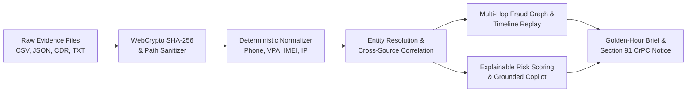

---

## 7. System Architecture

<div align="center">
  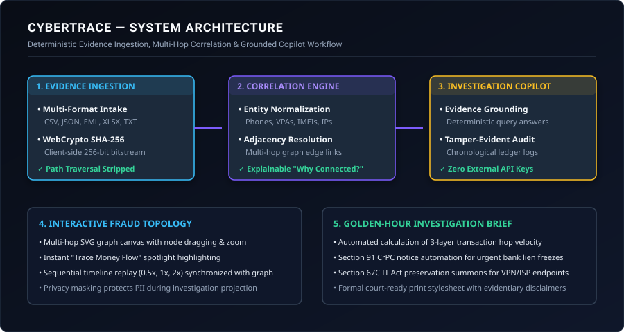
</div>

CYBERTRACE is architected into 4 clean layers:
1. **Client & Ingestion Layer:** High-performance React 19 / TypeScript application with dark forensic workstation styling.
2. **Forensic Pipeline:** File validation, directory traversal sanitization, and WebCrypto SHA-256 bitstream hashing.
3. **Intelligence & Correlation Engine:** Canonical normalization, entity deduplication, and additive risk scoring matrix.
4. **Presentation & Action Layer:** Vector SVG topology, scrub replay player, grounded AI copilot, and Golden-Hour statutory form generator.

For full technical details, see [System Architecture Documentation](docs/architecture/system-architecture.md).

---

## 8. Evidence Processing Pipeline

<div align="center">
  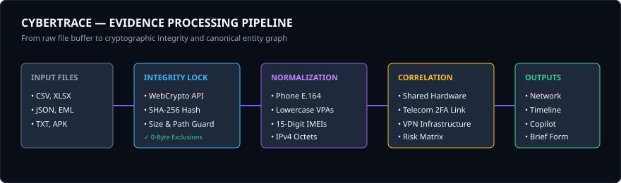
</div>

- **Step 1:** File dropped into `EvidenceUploadZone`.
- **Step 2:** File validated against extension whitelist (`.csv`, `.xlsx`, `.json`, `.txt`, `.eml`, `.pdf`, `.apk`), size thresholds (&lt; 25 MB), and 0-byte checks.
- **Step 3:** Bitstream processed via `crypto.subtle.digest('SHA-256')` producing an immutable 64-character fingerprint.
- **Step 4:** Parsed records scanned with regex tokenizers to extract target identifiers.

---

## 9. Entity Correlation

<div align="center">
  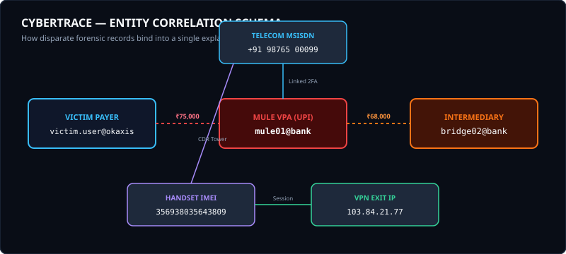
</div>

CYBERTRACE breaks operational silos by matching canonical identifiers across different evidence files:
- **The Telecom Link:** CDR tower records tie phone `9876500099` to victim `9876500011` in a 184-second pre-incident call.
- **The Banking Link:** The same phone number is registered as the mobile banking 2FA identifier for primary mule `mule01@bank`.
- **The Hardware Link:** Handset IMEI `356938035643809` links the suspect SIM to chat operator sessions from VPN exit IP `103.84.21.77`.

For detailed data models, see [Entity Correlation Architecture](docs/architecture/entity-correlation.md).

---

## 10. Fraud Network Reconstruction

<div align="center">
  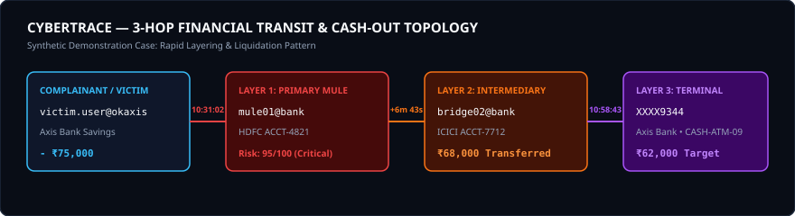
</div>

The interactive network graph visually isolates the 3-hop financial transit:
1. **Hop 1 (Initial Debit):** ₹75,000 transferred via UPI from `victim.user@okaxis` to primary mule `mule01@bank` (10:31:02).
2. **Hop 2 (IMPS Layering):** ₹68,000 forwarded within 6m 43s to intermediary account `bridge02@bank` (10:42:11).
3. **Hop 3 (Terminal Cash-Out):** ₹62,000 routed toward cash-out endpoint `XXXX9344` for ATM liquidation at `CASH-ATM-09` (10:58:43).
4. **Retained Commission:** ₹7,000 observed difference retained across intermediary mule nodes.

---

## 11. Investigation Replay

<div align="center">
  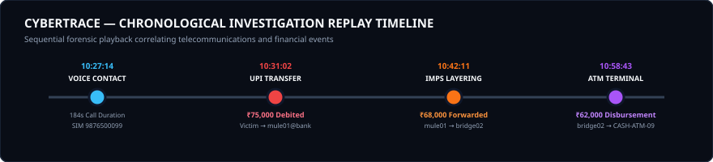
</div>

The Investigation Replay engine reconstructs events in chronological sequence. As investigators scrub through the timeline, the network graph updates synchronously, highlighting how telecommunications contact directly triggered fund movement.

---

## 12. Explainable Risk Intelligence
Risk scores ($0 - 100$) are calculated additively via transparent mathematical factors:
- **Repeated Cross-Source Appearance (+25 Points):** Entity verified across independent files.
- **Rapid Transaction Velocity (+20 Points):** Outward transit completed in &lt; 10 minutes.
- **Shared Device Nexus (+20 Points):** Handset IMEI shared across multiple identities.
- **Shared VPN Infrastructure (+15 Points):** Sessions originating from anonymized VPN exit nodes.
- **Pre-Incident Communication (+10 Points):** Voice call registered prior to first transfer.

See [Risk Scoring Theory](docs/theory/risk-scoring.md) for full mathematical formulation.

---

## 13. AI Investigation Copilot

<div align="center">
  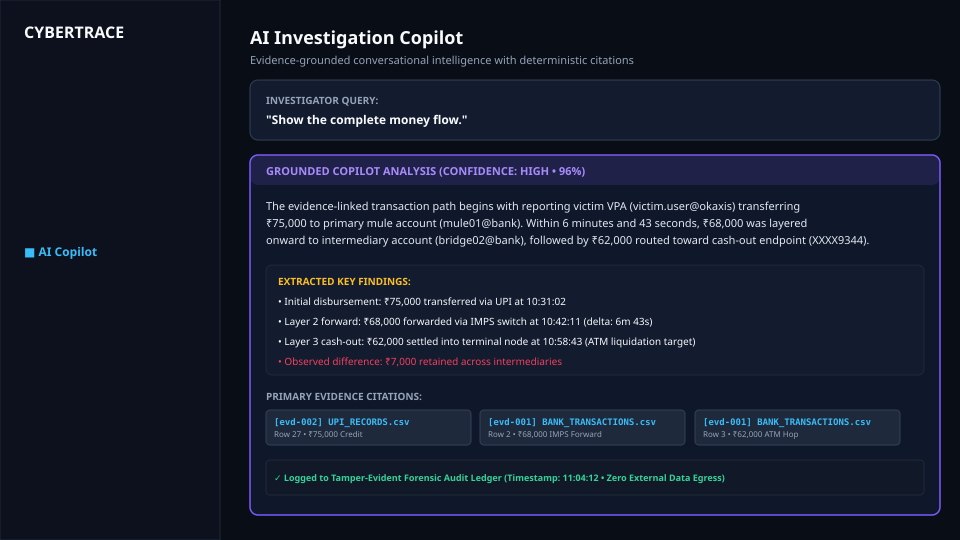
</div>

CYBERTRACE's Copilot operates 100% locally with zero external API dependencies:
- **Deterministic Answering:** Responds to investigative queries using pattern matching and verified evidence indexing.
- **Evidence Citations:** Cites exact evidence filenames and row references.
- **Hallucination Prevention:** If an inquiry cannot be supported by case evidence, it responds:
  > *"Insufficient evidence in the current investigation dataset to reliably answer this query."*
- **Audit Ledger:** Automatically logs all queries, answers, evidence IDs, and confidence levels.

---

## 14. Golden-Hour Investigation Brief

<div align="center">
  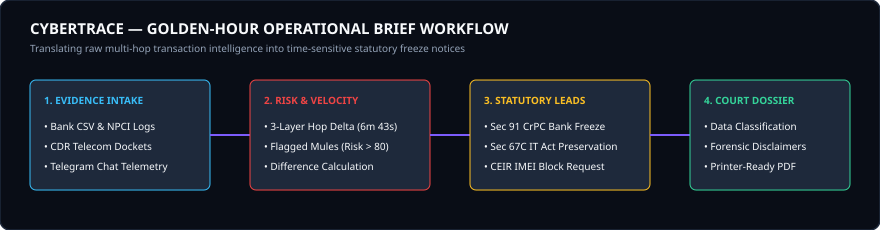
</div>

<div align="center">
  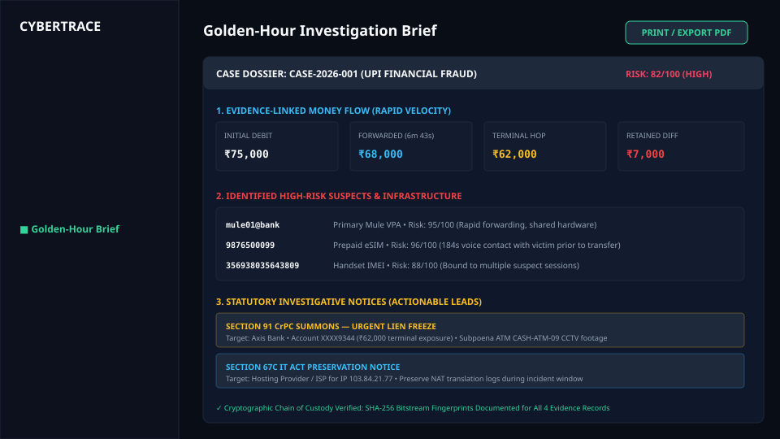
</div>

During the critical initial hours following cyber fraud, CYBERTRACE compiles an executive operational brief:
- Categorizes intelligence into `VERIFIED EVIDENCE`, `DERIVED ANALYSIS`, and `INVESTIGATIVE LEADS`.
- Automatically prepares ready-to-issue **Section 91 CrPC** summons for banking lien freezes.
- Automatically prepares **Section 67C IT Act** preservation summons for VPN/ISP logs.
- Features formal court-ready print styling (`window.print()`).

---

## 15. Evidence Integrity & Security
CYBERTRACE implements defense-in-depth safeguards:
- **WebCrypto Cryptographic Hashing:** 64-character SHA-256 bitstream calculation.
- **Strict Input Sanitization:** Regex removal of directory traversal sequences (`..`) and 25MB boundary limits.
- **Fault-Isolated Error Boundaries:** Component-level anomalies are isolated without leaking system stack traces.
- **Privacy Obfuscation:** Masks sensitive PII (`98765••••11`) during presentations while preserving underlying correlation.
- **Zero XSS:** 0 instances of `dangerouslySetInnerHTML` across the entire codebase.

---

## 16. Technical Stack

| Layer | Technology | Purpose |
| :--- | :--- | :--- |
| **Frontend Framework** | React 19 | High-performance reactive UI rendering |
| **Language** | TypeScript (Strict Mode) | Type safety, zero compilation errors (`tsc -b`) |
| **Build & Bundling** | Vite 8.x | Sub-second HMR and optimized static production builds |
| **Styling & Theme** | Vanilla CSS Design Tokens | Dark forensic workstation aesthetic without utility bloat |
| **Icons** | Lucide React | Semantic forensic and investigative iconography |
| **Cryptography** | Browser WebCrypto API | Client-side SHA-256 bitstream hash calculation |
| **Fault Isolation** | React Error Boundaries | Component fault isolation without crash cascades |
| **Intelligence Engine** | Deterministic Heuristics | 100% local, offline rule-grounded correlation and Copilot |

---

## 17. Project Structure

```text
d:/PERCEPTOMINDS/
├── docs/                             # Comprehensive Technical Documentation
│   ├── architecture/                 # System architecture & data flow
│   ├── diagrams/                     # High-resolution vector SVG diagrams
│   ├── theory/                       # Digital forensics & risk scoring theory
│   ├── screenshots/                  # UI showcase vector screenshots
│   ├── demo/                         # 3-minute hackathon demo guide
│   └── references.md                 # NIST, CERT-In, and statutory references
├── public/                           # Static assets (Favicons, SVG icons)
├── src/
│   ├── assets/                       # Branding images and SVGs
│   ├── components/
│   │   ├── brief/                    # Golden-Hour Brief & print views
│   │   ├── copilot/                  # Grounded Copilot & audit trail
│   │   ├── dashboard/                # Metrics cards & system status
│   │   ├── entities/                 # Entity table, filters, Why Connected modal
│   │   ├── evidence/                 # Evidence Vault, upload zone, previews
│   │   ├── investigations/           # Case dockets, overview, intake modal
│   │   ├── layout/                   # AppShell, Sidebar, TopHeader
│   │   ├── network/                  # Interactive SVG graph canvas & filters
│   │   ├── timeline/                 # Replay player & synchronized graph
│   │   └── ui/                       # Design system primitives & Error Boundary
│   ├── data/                         # Synthetic demo dockets & evidence items
│   ├── services/                     # Intelligence, Copilot, and Brief services
│   ├── types/                        # TypeScript domain interfaces
│   ├── utils/                        # WebCrypto SHA-256 & security utilities
│   ├── App.tsx                       # Main workstation application root
│   ├── main.tsx                      # DOM entrypoint
│   └── index.css                     # Global forensic design tokens
├── index.html                        # HTML5 shell
├── package.json                      # Dependency manifests & build scripts
├── tsconfig.json                     # TypeScript strict configuration
└── vite.config.ts                    # Vite configuration
```

---

## 18. Screenshots

### 1. Investigation Dashboard
<div align="center">
  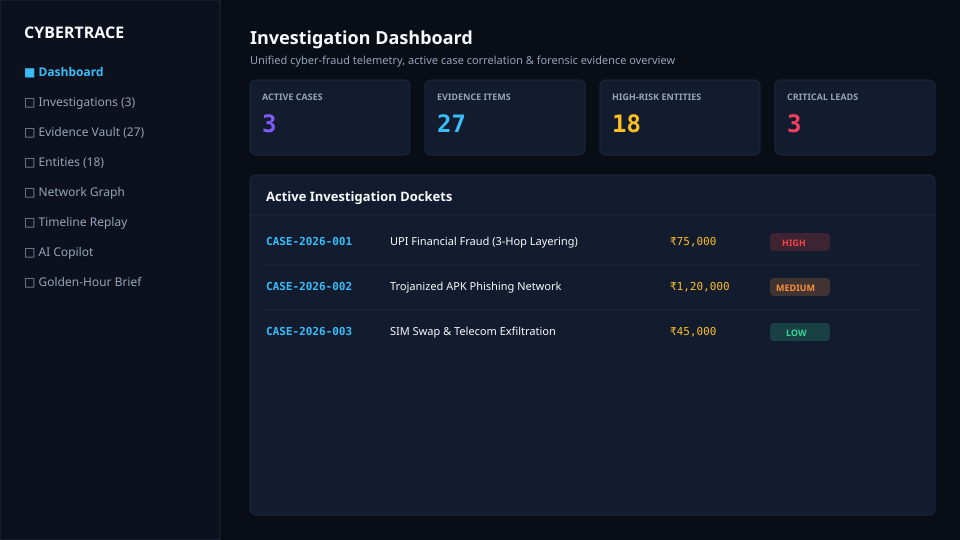
  <p><em>Unified cyber-fraud telemetry overview displaying active case dockets, evidence counts, and system status.</em></p>
</div>

### 2. Fraud Network Graph
<div align="center">
  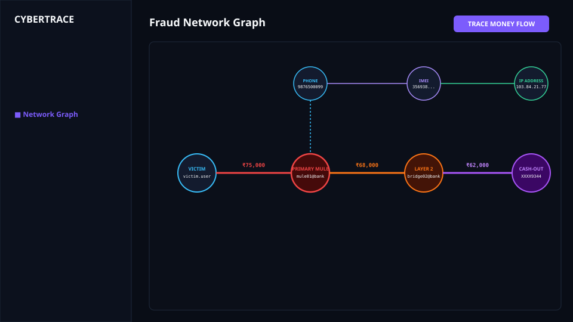
  <p><em>Interactive vector SVG topology with spatial multi-hop node layout and instant "Trace Money Flow" highlighting.</em></p>
</div>

### 3. AI Investigation Copilot
<div align="center">
  
  <p><em>Evidence-grounded conversational assistant providing deterministic answers with exact file and row citations.</em></p>
</div>

### 4. Golden-Hour Investigation Brief
<div align="center">
  
  <p><em>Court-ready operational dossier with automated Section 91 CrPC notice generation and financial transit breakdown.</em></p>
</div>

---

## 19. Demo Workflow
For a step-by-step 3-minute hackathon judge walkthrough, consult the [Demonstration Guide](docs/demo/demo-flow.md):
1. **Dashboard:** Select synthetic case `CASE-2026-001`.
2. **Evidence Vault:** Verify SHA-256 integrity hashes on ingested artifacts.
3. **Entities:** Showcase privacy masking mode (`98765••••11`).
4. **Network Graph:** Activate `[ TRACE MONEY FLOW ]` to isolate the 3-hop transit path.
5. **Timeline Replay:** Scrub events to show the pre-incident voice call followed by fund transfer.
6. **Copilot:** Ask *"Show the complete money flow."* to verify grounding and citations.
7. **Golden-Hour Brief:** Export court-ready statutory brief for bank lien freeze.

---

## 20. Installation

### Prerequisites
- Node.js (v18.0 or higher)
- npm or pnpm

```bash
# Clone the repository
git clone https://github.com/snappyff43-hub/Void-Hackathon.git
cd Void-Hackathon

# Install dependencies
npm install
```

---

## 21. Running Locally

```bash
# Start the local development server
npm run dev
```
Open [http://localhost:5173/](http://localhost:5173/) in any modern web browser.

```bash
# Compile and build production bundle
npm run build

# Preview production build locally
npm run preview
```

---

## 22. Example Investigation

```text
Case ID:            CASE-2026-001 (UPI Financial Fraud)
Victim:             victim.user@okaxis (Axis Bank)
Initial Debit:      ₹75,000 (10:31:02 via UPI)
Primary Mule:       mule01@bank (HDFC Bank • ACCT-4821 • Risk: 95/100)
Layer 2 Forward:    bridge02@bank (ICICI Bank • ACCT-7712 • ₹68,000 • +6m 43s)
Terminal Hop:       XXXX9344 (Axis Bank • ₹62,000 target • ATM CASH-ATM-09)
Retained Diff:      ₹7,000 (Mule commission retained across intermediaries)
Pre-Incident Call:  MSISDN 9876500099 (184s voice call at 10:27:14)
Hardware Nexus:     IMEI 356938035643809 bound to suspect phone and VPN exit IP 103.84.21.77
```

---

## 23. Research & References
CYBERTRACE adheres to scientific standards published by:
- **NIST SP 800-86:** Guide to Integrating Forensic Techniques into Incident Response.
- **NIST CSF 2.0:** National Cybersecurity Framework.
- **ISO/IEC 27037:2012:** Guidelines for Digital Evidence Handling.
- **CERT-In Directions:** Retention and correlation of telecommunications and IP traffic logs.
- **Section 91 CrPC & Section 67C IT Act:** Statutory legal notices.

Read the complete bibliography in [docs/references.md](docs/references.md).

---

## 24. Future Scope

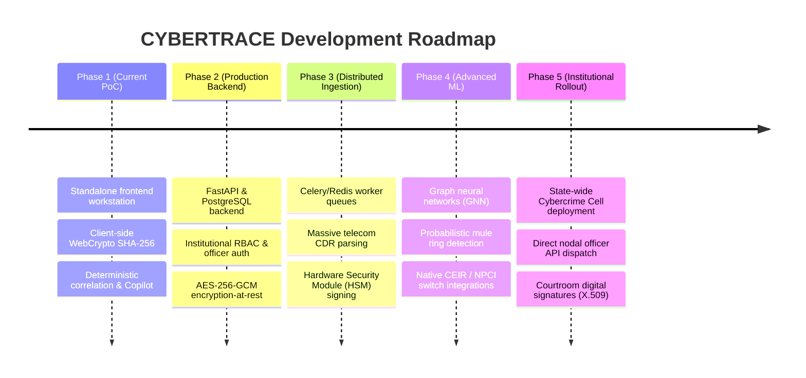

---

## 25. Team PerceptoMinds
- **Lead Software Architect & Forensic Product Engineer:** Team PerceptoMinds
- **Project Domain:** Cybercrime Forensics, Digital Evidence Correlation & FinTech Security

---

## 26. Hackathon Information
- **Hackathon:** Void Hackathon 2026
- **Problem Statement:** AI-Powered Unified Cyber Fraud Investigation & Evidence Correlation
- **Repository:** [https://github.com/snappyff43-hub/Void-Hackathon.git](https://github.com/snappyff43-hub/Void-Hackathon.git)
- **Status:** Complete, Verified & Production Deployment Ready

---

## 27. License
This project is licensed under the [Apache License 2.0](LICENSE).
