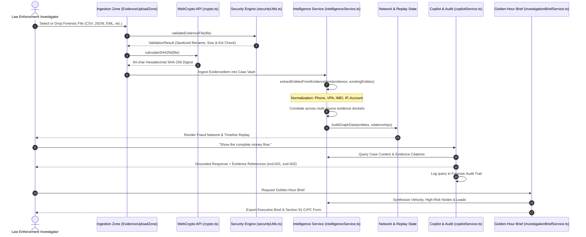

# CYBERTRACE — Data Flow Architecture

## Evidentiary Ingestion to Actionable Intelligence

CYBERTRACE converts raw, disjointed forensic files into structured, evidence-grounded intelligence without external network egress or third-party AI dependencies.

---

## Detailed Data Transformations

### 1. Ingestion Phase
- **Input:** Raw binary or text file (`BANK_TRANSACTIONS.csv`, `CDR_001.csv`, `CHAT_EXPORT.json`).
- **Operation:** Filename path traversal stripping, 25MB boundary check, `crypto.subtle.digest('SHA-256')`.
- **Output:** Verified `EvidenceItem` with cryptographic fingerprint.

### 2. Normalization Phase
- **Input:** Unstructured or semi-structured record strings.
- **Operation:** Specialized deterministic sanitizers:
  - Phone numbers converted to 10-digit national canonical format.
  - Virtual Payment Addresses trimmed and lowercased.
  - IMEI strings stripped of hyphens and spaces to 15 digits.
  - Bank account identifiers parsed to standardized token masks.
- **Output:** Normalized `Entity` structs.

### 3. Correlation Phase
- **Input:** Normalized entities from multiple distinct evidence files.
- **Operation:** Adjacency mapping where shared identifiers link disparate datasets:
  - Phone `9876500099` connects CDR voice logs with mobile banking 2FA registrations.
  - IMEI `356938035643809` connects telecommunications tower logs with network endpoint chat exports.
- **Output:** Directed `EntityRelationship` records with confidence scores ($89\%-96\%$).

### 4. Downstream Dissemination
- State flows dynamically into:
  - **Network Graph:** SVG adjacency visualization with interactive money-flow tracing.
  - **Investigation Replay:** Chronological step execution.
  - **AI Copilot:** Deterministic contextual retrieval for natural language investigative queries.
  - **Golden-Hour Brief:** High-velocity lead formulation and printer-friendly PDF output.
