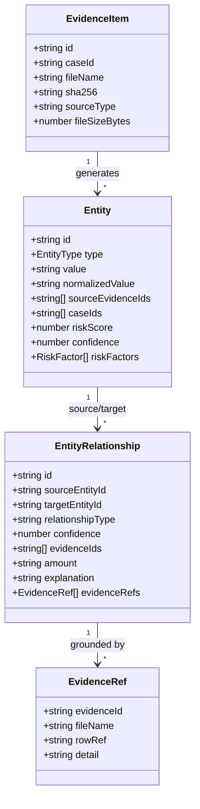

# CYBERTRACE — Entity Correlation Architecture

## The Multi-Source Correlation Challenge
In modern cyber-fraud syndicates, perpetrators deliberately partition their infrastructure across multiple identity silos:
- Telecom identities (prepaid SIMs / eSIMs)
- Payment identifiers (UPI VPAs on NPCI switches)
- Core banking accounts (layered mule accounts across multiple banks)
- Hardware devices (handsets identified by TAC/IMEI)
- Network infrastructure (VPN exit nodes and datacenters)

Because individual evidence artifacts (e.g. a single bank statement or a CDR export) only capture localized fragments, traditional siloed inquiries fail to detect syndicate rings.

---

## Correlation Model

---

## Relationship Taxonomy

| Relationship Type | Description | Evidentiary Grounding | Confidence |
| :--- | :--- | :--- | :---: |
| `TRANSFERRED_TO` | Direct monetary dispatch between payer and payee accounts/VPAs | Bank statements, IMPS switch telemetry, NPCI logs | 92% – 96% |
| `ASSOCIATED_WITH` | Hardware-to-network or identity-to-device binding | CDR cellular tower logs, device session telemetry | 89% – 95% |
| `COMMUNICATION_LINK` | Voice call, SMS exchange, or instant message coordination | Telecom CDR records, operator session dumps | 91% |

---

## "Why Connected?" Explainability Mechanism

Rather than reporting a black-box correlation probability, CYBERTRACE requires every detected edge to provide an immutable evidentiary basis. When an investigator inspects a connection, the **Why Connected?** subsystem presents:
1. **Source & Target Identifiers:** Normalized entity representations.
2. **Deterministic Explanation:** Human-readable synopsis (e.g., *"The same normalized phone number 9876500099 is registered as the mobile banking 2FA identifier for VPA mule01@bank"*).
3. **Primary Evidence Citations:** Exact evidence file names, evidence IDs, and specific row references (e.g., `UPI_RECORDS.csv`, Row 27).
4. **Confidence Assessment:** Computed score based on multi-source corroboration.
