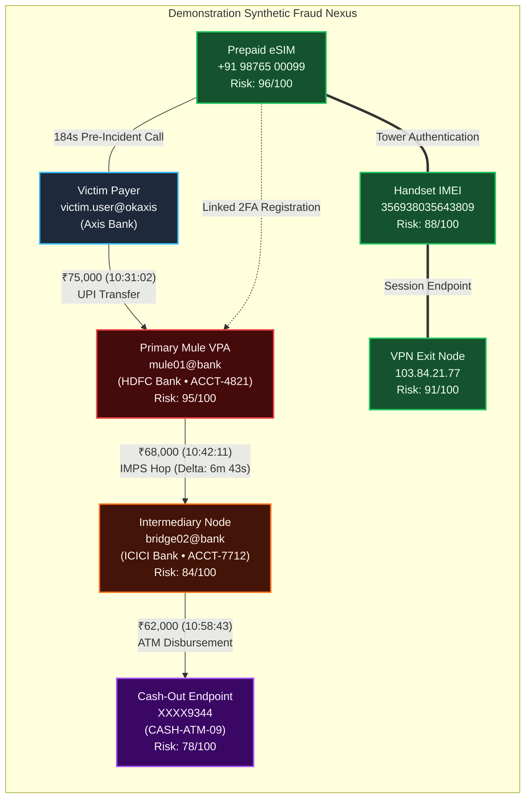

# CYBERTRACE — Fraud Network Reconstruction

## Multi-Hop Fraud Topology

Modern cyber-fraud networks operate via structured layering techniques:
1. **Victim Inception:** Deception or phishing triggers fund departure from the victim's account.
2. **Primary Mule Ingestion:** Rapid intake into a primary mule account (`mule01@bank`).
3. **Intermediary Layering:** Rapid fragmentation or onward transit to secondary bridge accounts within minutes (`bridge02@bank`).
4. **Endpoint Cash-Out:** Settlement into termination accounts followed by physical ATM liquidation (`XXXX9344`).

---

## Interactive Visualization Engine
CYBERTRACE features a custom vector SVG rendering engine optimized for forensic clarity:
- **Spatial Node Layout:** Deterministic default coordinates arranged logically from left-to-right (Victim $\to$ Mule $\to$ Intermediary $\to$ Cash-Out), supplemented by circular layout algorithms for dynamically ingested nodes.
- **Interactive Dragging & Physics:** Direct node manipulation with drag-offset recalculation.
- **Trace Money Flow:** Instant high-contrast filtering that dims telecommunication and network nodes while spotlighting the financial transit path and retained commission differences.
- **Zoom & Pan Controls:** Smooth SVG viewBox matrix transformations allowing investigators to navigate dense multi-hop topologies.
