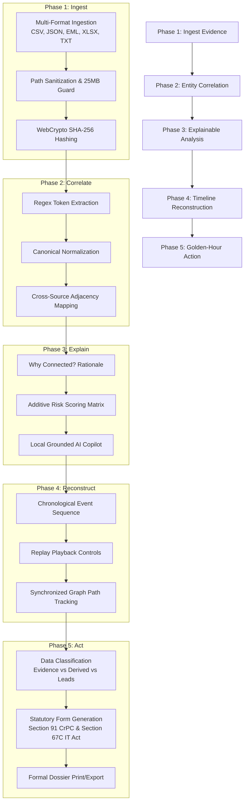

# CYBERTRACE — End-to-End Investigation Workflow

## The 5-Phase Investigative Pipeline

CYBERTRACE streamlines the investigation lifecycle into an actionable operational journey:
$$\text{INGEST} \longrightarrow \text{CORRELATE} \longrightarrow \text{EXPLAIN} \longrightarrow \text{RECONSTRUCT} \longrightarrow \text{ACT}$$

---

## Detailed Step-by-Step Operations

### Step 1: Ingestion & Integrity Lock
Investigators import raw transaction logs, telecommunication CDR files, and chat records into the case Evidence Vault. The client-side WebCrypto engine generates cryptographic SHA-256 fingerprints before files are parsed, guaranteeing chain-of-custody compliance.

### Step 2: Entity Extraction & Normalization
The engine parses raw text to extract phone numbers, bank accounts, UPI handles, IMEIs, and IP addresses. Identifiers are converted into canonical formats, preventing deduplication failures caused by formatting variations (e.g. `+919876500099` vs `098765-00099`).

### Step 3: Graph Modeling & Explainable Rationale
Normalized entities are interconnected into directed network graphs. Every edge documents its exact evidentiary grounding. Investigators can click on any connection to invoke the **Why Connected?** inspection modal.

### Step 4: Investigation Replay
The investigator replays events chronologically. As events advance, the synchronized topology canvas highlights the participating source and target nodes, visually illustrating how pre-incident voice calls directly preceded subsequent financial transfers.

### Step 5: AI-Assisted Q&A & Copilot Grounding
The investigator queries the local AI Copilot for case summaries, money flow paths, and suspect profiles. All answers strictly cite verified evidence items. Every interaction is recorded in a tamper-evident query audit ledger.

### Step 6: Golden-Hour Brief Generation
During the critical initial hours of an inquiry ("The Golden Hour"), investigators generate the Golden-Hour Brief. The system computes transaction velocity across transit hops and automatically prepares statutory notices (such as Section 91 CrPC freeze orders for beneficiary banks).
