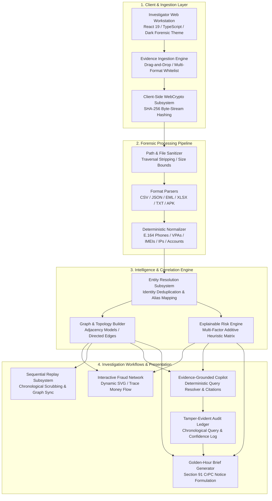

# CYBERTRACE — System Architecture

## Architectural Philosophy
CYBERTRACE is architected as an **evidence-first, deterministic digital forensics workstation**. In cyber-fraud investigations, evidentiary provenance and explainability must supersede probabilistic black-box generation. Consequently, CYBERTRACE decouples data ingestion, cryptographic validation, deterministic entity extraction, multi-hop graph modeling, and AI-assisted investigative reporting.

---

## High-Level Architecture Diagram

---

## Component Layers

### 1. Ingestion & Cryptographic Integrity Layer
- **Input Sanitization:** Strips directory traversal patterns (`..`, control characters, path delimiters) and enforces strict 25 MB file size bounds.
- **Cryptographic Hashing:** Executes native browser `window.crypto.subtle.digest('SHA-256', buffer)` on raw byte streams before parsing to create an immutable digital chain of custody.

### 2. Normalization & Entity Extraction Layer
- **Normalization Utilities:**
  - Phone: Cleans non-digits, strips country code `+91` or `91` if 12 digits, removes leading `0`.
  - UPI VPA: Trims and forces lowercase (`victim.user@okaxis`).
  - IP Address: Strips port mappings, verifies IPv4 octet bounds (`103.84.21.77`).
  - Bank Account: Strips whitespace/hyphens, capitalizes account masks (`ACCT-4821`).
  - IMEI: Strips punctuation, validates 15-digit TAC specifications (`356938035643809`).

### 3. Intelligence & Multi-Hop Correlation Layer
- Resolves normalized entities across separate files (e.g. Bank Statements + CDR telecom logs + NPCI UPI logs).
- Builds directed adjacency edges with confidence levels ($88\% - 99\%$) and explicit provenance citations.
- Evaluates risk additively based on velocity ($< 10\text{ min}$ hop delta), shared hardware nexus (shared IMEI), and shared infrastructure (VPN exit IP).

### 4. Presentation & Decision Support Layer
- **Fraud Network Graph:** Vector SVG canvas supporting dynamic force layout, pan/zoom, node dragging, and instant money flow highlighting.
- **Investigation Replay:** Chronological scrub player synchronizing timeline events with spatial network paths.
- **Evidence-Grounded Copilot:** Local deterministic NLP engine that answers investigative queries strictly from evidence records and automatically logs each query into an in-memory audit ledger.
- **Golden-Hour Brief:** Formulates executive statutory actions, including formal Section 91 CrPC notices for banking lien freezes and Section 67C IT Act data preservation notices.
